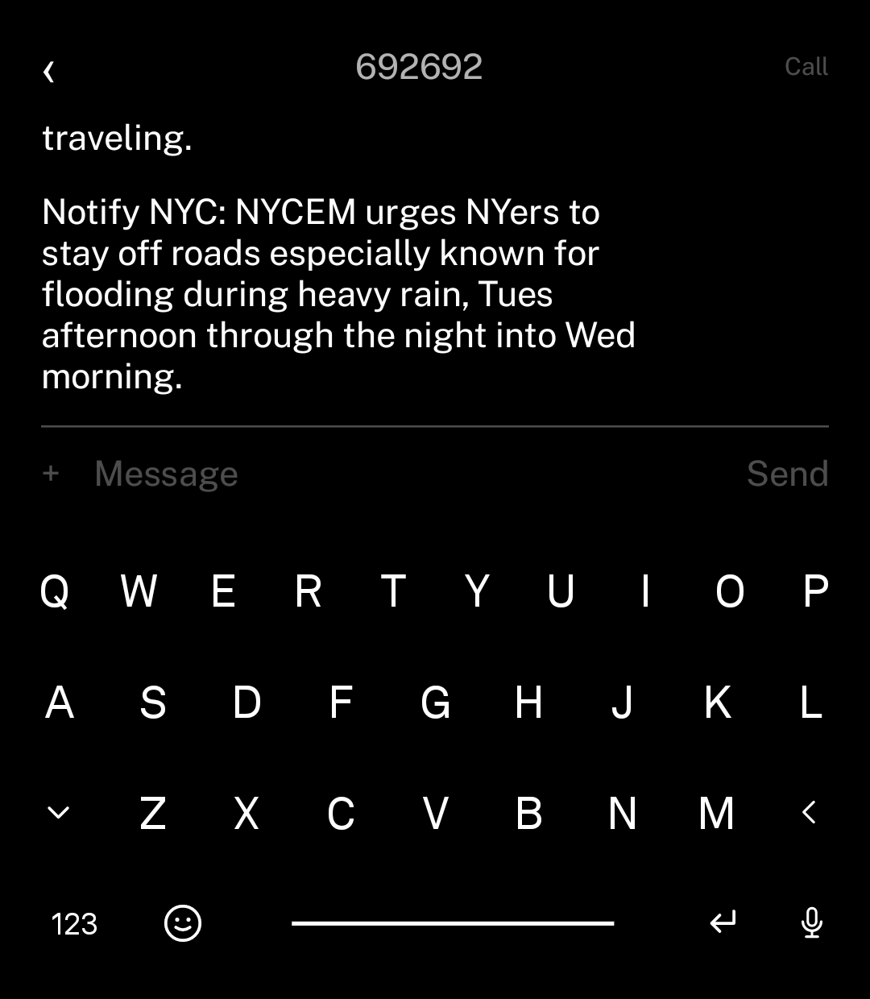

> ### About this fork
>
> This is **LightChat**, [gi-os](https://github.com/gi-os)'s fork of
> **[craigeley/chat](https://github.com/craigeley/chat)**. Craig Eley wrote the app.
> The README below is his, kept as he wrote it.
>
> The fork renames the app to LightChat (`com.gios.lightchat`) to sit with the rest of
> the [gi-os Light Phone tools](https://github.com/gi-os/awesome-light), and adds:
>
> - **Favorites / Known / Unknown tabs.** The conversation list is three lists behind an
>   icon bar: starred chats, chats with a name in the Mac's address book, and everything
>   else. Long-press a row to star it. Exiting a thread returns you to where you were in
>   the list rather than the top of it.
> - **Full-colour photos.** Tapping a photo lifts LightOS's grayscale for exactly as long
>   as the viewer is open. Needs a one-time adb grant — see below.
> - **Heads-up messages.** A minimal box over whatever you're doing when a text arrives,
>   with the sender, the message, and a buzz. Needs a one-time adb grant — see below.
> - **A photo picker that works.** The system one reads MediaStore, which nothing keeps
>   current on LightOS, so photos you just took were never offered. This one reads DCIM
>   and Pictures directly. Multi-select, an inline camera, and the whole thing runs in
>   colour — with the grayscale grant above, picking and framing a photo aren't guesswork.
>
> <p>
> 
> </p>
>
> **Coming from the old `com.craigeley.chat` build?** The package id changed, so this
> installs alongside it rather than updating it. Uninstall the old one, re-run setup
> (or push it over adb, below), re-run both `adb` grants, and re-add the app in
> Obtainium — it sees a different package. Starred chats don't carry over either.
>
> APKs are published to [Releases](https://github.com/gi-os/LightChat/releases) when a
> `v*` tag is pushed, signed with a stable key so Obtainium can update in place.
> [CLAUDE.md](CLAUDE.md) documents the internals, including the known gaps.
>
> Nothing here is upstream's responsibility. Send bugs in these features to this repo,
> not to Craig.

# LightChat

An **iMessage client** for the [Light Phone III](https://www.thelightphone.com/),
inspired by and based on the apps created by [vandamd](https://github.com/vandamd). The app works by talking to an always-on, self-hosted [BlueBubbles Server](https://github.com/BlueBubblesApp/bluebubbles-server), reached privately over [Tailscale](https://tailscale.com/).

I built this to replace OpenBubbles on my LPIII, which I found to be both a battery hog and very flaky in terms of displaying and ordering messages correctly.

Open the app to a list of conversations (newest activity first); tap one to read the
thread, or tap **New** to start one (searches your contacts by name/number/email).
Tap **Messages** at the top for settings, **Refresh** to re-pull.

## Prequisites

There are several things you have to have up and running in order for this to work.

1. A LightPhoneIII modified to reveal the full Android layer. For full instructions on this, I highly recommend fully reading [this guide](https://acrobat.adobe.com/id/urn:aaid:sc:US:0c80fa32-de30-406f-85ca-93ccd92c3c4b).
2. A BlueBubbles server up and running on an always-on Mac, which is signed into your iMessage account.
3. Tailscale installed on your Mac *and* and your modified LPIII.

## Setup

1. **Install BlueBubbles Server**. Install it from
   [bluebubbles.app](https://bluebubbles.app/install/) on a Mac that is signed
   into your iMessage account and stays awake. During setup
   it asks you to set a server password — remember it; the app uses it to
   authenticate.
   
   In the setup steps, you should **skip / ignore** the Google Firebase section entirely, as well as the Proxy Service. You can set that to LAN only. Tailscale (in the next step) will handle it from here.

2. **Put the Mac and the phone on the same tailnet.** Install
   [Tailscale](https://tailscale.com/download) on both and sign them into the
   same account. On the Mac, expose the BlueBubbles port (default `1234`) over
   HTTPS with Tailscale Serve:

   `tailscale serve --bg 1234`

   This gives the Mac a stable `https://<machine>.<tailnet>.ts.net` URL with TLS,
   reachable only from your own devices — no public exposure, no certificates to
   manage. (Any other HTTPS reverse proxy works too; Tailscale Serve is just the
   easiest.) Run `tailscale serve status` to see the URL.

3. Install this app. The best way to do it is to put this url into Obtainium.

4. **Configure the app.** On first launch, enter that `https://…ts.net` URL and
   the BlueBubbles server password. The app validates them against the server and
   stores them on the device.

### Optional: enable the Private API (tapbacks, read receipts, typing)

By default BlueBubbles can only send via AppleScript, which can't send tapbacks,
mark chats read, or send typing indicators. For a full list of features enabled by the private API, see this page. Those need BlueBubbles' **Private
API**, which injects a helper into Messages — and that requires turning off two
macOS protections. It's optional; skip this and everything else still works.

1. **Disable Library Validation** (lets the helper load into Messages):

   ```sh
   sudo defaults write /Library/Preferences/com.apple.security.libraryvalidation.plist DisableLibraryValidation -bool true
   ```

2. **Disable System Integrity Protection (SIP).** Boot into Recovery
   (Apple Silicon: hold the power button → *Options*; Intel: hold ⌘R at boot),
   open Terminal, run `csrutil disable`, then reboot. Verify with `csrutil status`
   — it should read `disabled`. (On Apple Silicon this also disables running iOS
   apps on the Mac.) Do this at your own risk; a VM snapshot first is wise.

3. **Flip it on in the server.** BlueBubbles Server → *Settings* → **Private API**
   toggle on. There's no bundle to install by hand — the server injects the helper
   itself. Hit refresh on the **Private API Status** box; it should report the
   helper connected. (`GET /api/v1/server/info` then shows `"private_api": true`
   and `"helper_connected": true` — the app reads this to decide whether to offer
   tapbacks etc.)

### Optional: full-color photo viewing

The Light Phone's grayscale is Android's accessibility color-correction filter,
which apps can lift with a permission only grantable over adb. With it granted,
tapping a photo in a thread shows it in **full color** for exactly as long as
the viewer is open — the phone returns to grayscale the moment you dismiss it
(the same trick as [zero](https://github.com/vandamd/zero)'s red-text mode):

```sh
adb shell pm grant com.gios.lightchat android.permission.WRITE_SECURE_SETTINGS
```

One-time; it survives app updates. Without it, photos simply open in grayscale
like the rest of the phone.

### Optional: heads-up messages

A text arriving while you're somewhere else on the phone buzzes and drops a small
box over whatever you're doing: sender, two lines of message, gone in four and a
half seconds. Tap it to open the thread, swipe up to dismiss it early. It also
wakes the panel, so a message arriving with the phone face-down still shows.

Getting a window up from the background needs one appop, which on Android 14 is
what exempts an app from background-activity-start restrictions:

```sh
adb shell appops set com.gios.lightchat SYSTEM_ALERT_WINDOW allow
```

One-time; survives reboots and app updates. Without it you still get the buzz and
the notification, just not the box.

For instant delivery after a reboot without opening the app, enable Tailscale's
**Always-on VPN** on the phone (Android Settings → Network → VPN) and leave
"Block connections without VPN" **off** — the live socket reconnects the moment
the tunnel comes up.

## Install

Install the app via Obtainium.

## License

[MIT](LICENSE).
